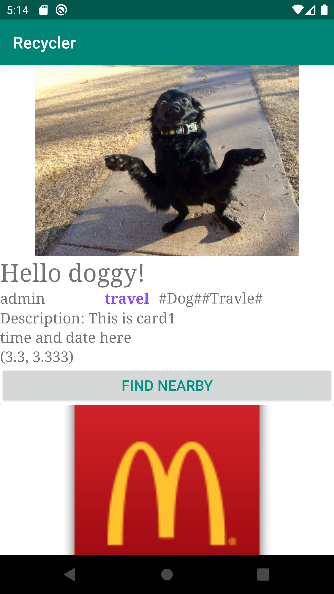

Tutorial: How to add recyclerlayout to your androidX app

------

Erin, 27/Oct/2019



##### Quick Start

Run the program to see how cardCiew can work with recyclerView.

##### How to Deploy

Step 1.  Add dependencies in `build.gradle`

```kotlin
dependencies {
	implementation "androidx.recyclerview:recyclerview:1.0.0"
    // For control over item selection of both touch and mouse driven selection
    implementation "androidx.recyclerview:recyclerview-selection:1.0.0"
    // Add glide to apply fetch online images
    implementation "com.github.bumptech.glide:glide:4.10.0"
    annotationProcessor "com.github.bumptech.glide:compiler:4.10.0"
}
```

Step 2. Add internet permission in `AndroidManifest.xml`

```xml
<manifest>
...
	<uses-permission android:name="android.permission.INTERNET"/>
    <uses-permission android:name="android.permission.WRITE_EXTERNAL_STORAGE" />
    <uses-permission android:name="android.permission.ACCESS_NETWORK_STATE" />
...
</manifest>
```

Step 3. Deploy key files to your app

```
/app
	/java
		/com.example.xxx
			Report.kt
			RecyclerAdapter.kt
	/res
		/layout
			card.xml
```

Step 4. Add a recyclerView in your activity with the following properties

```xml
android:id="@+id/recycler_view"
android:scrollbars="vertical"
android:layout_width="match_parent"
android:layout_height="match_parent">
```

Step 5. Add viewManager and viewAdapter for your recyclerView in your activity. Below is an example which adds the 2 components to an empty activity

```java
package com.example.recycler

import androidx.appcompat.app.AppCompatActivity
import android.os.Bundle
import androidx.recyclerview.widget.LinearLayoutManager
import androidx.recyclerview.widget.RecyclerView

class MainActivity : AppCompatActivity() {
    private lateinit var recycler_view: RecyclerView
    private lateinit var view_adapter: RecyclerView.Adapter<*>
    private lateinit var view_manager: RecyclerView.LayoutManager

    override fun onCreate(savedInstanceState: Bundle?) {
        super.onCreate(savedInstanceState)
        setContentView(R.layout.activity_main)

        var reports = ArrayList<Report>()
        reports.add(Report("https://www.mcdonalds.com/etc/designs/mcdonalds/en/_jcr_content/genericpage/genericpagecontent/sitelevelconfiguration/logoimage.img.png", "report_id", "This is card1", "Title: McDonalds", "uid:admin_id", ))
        reports.add(Report("https://i.imgur.com/H981AN7.jpg", "This is card2"))

        view_manager = LinearLayoutManager(this)
        view_adapter = RecyclerAdapter(reports)

        recycler_view = findViewById<RecyclerView>(R.id.recycler_view).apply {
            layoutManager = view_manager
            adapter = view_adapter
        }
    }
}

```

